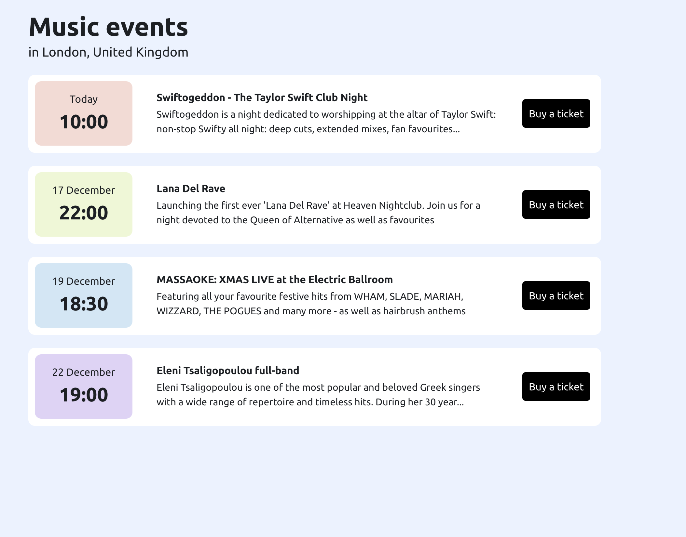

# Music event App 🎉

### Welcome to the **Music event App App**! This is a simple and clean web application built using **Reflex** that displays upcoming events, club meetups, and concerts. The app features a custom reusable component, making it easy to add new events and customize the layout.

#### 🎯 About the Project

This app is designed to provide a straightforward way to showcase events, club activities, and concerts. It includes:

- A **custom reusable component** for displaying event details.
- A clean and minimalistic design.
- Easy-to-update event listings.

### Install

`git clone https://github.com/AnonimPython/Reflex-music_events.git`

`pip install reflex`

`cd music-events`

`reflex run`

In terminal u will take URL of your server with app!
Have FUN.
